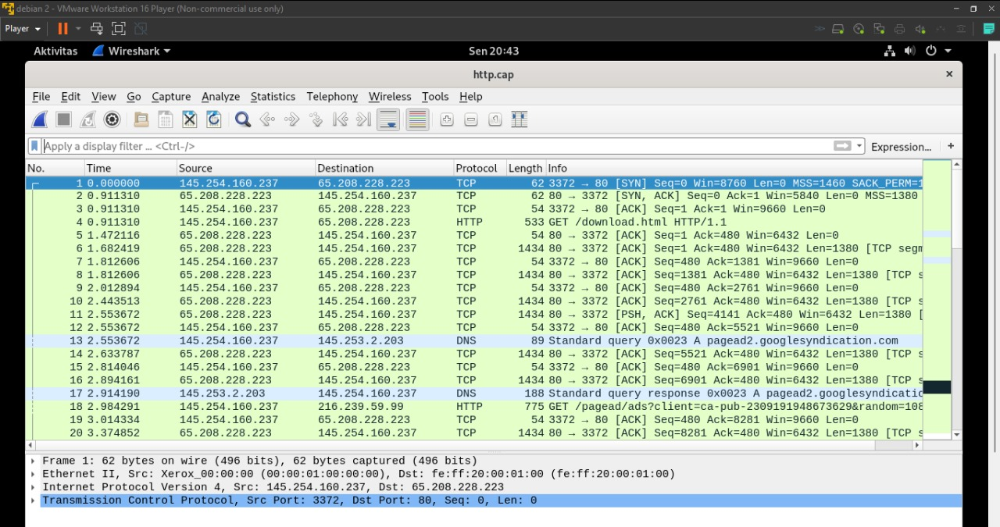

# 1224800007_Santi_TugasJaringan

### *** Tugas 1 ****
#### 1. Clone Dari Github
##### Clone socket dari github dengan link https://github.com/ferryastika/socket-programming-simple-server-and-client

#### 2. Test Dari Client
##### Melakukan perintah make untuk mengaktifkan sisi client ataupun sisi server 
##### Mengirimkan karakter "A" dari sisi client

#### 3. Test Dari Client
##### Respon sisi server terdapat penerimaan karakter "A"  yang dikirim dari sisi clinet

#### 4. Hasil Pengiriman Paket Pada Wireshark
##### Terdapat beberapa baris paket yang terlihat pada wireshark ketika kita mengirimkan beberapa kali pengiriman karakter pada sisi client

#### 5. Flow Graph Pada Pengiriman Paket
##### Terdapat Data Transfer dari paket. Hal ini dilihat dari [ACK] dan [PSH] flag pada flowgraph dibawah ini

### *** TUGAS 2 ***
#### 1. file http.cap di wireshark
##### Gambar pengiriman paket http.cap di wireshark

#### 2. Three Way Handsake
##### Terdapat Three Way Handsake di 3 baris pertama dengan alasan:
###### a. Ada [SYN], [SYN, ACK], [ACK] secara berurutan
###### b. Nomor flag ACK pada paket2 = seq paket1 + 1
###### c. Nomor flag ACK pada paket3 = seq paket2 + 1

