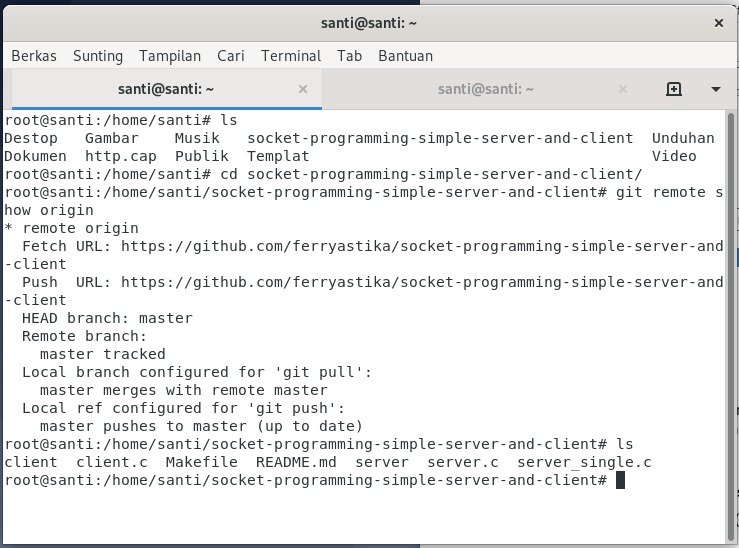
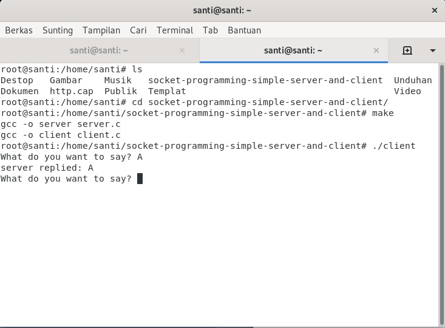
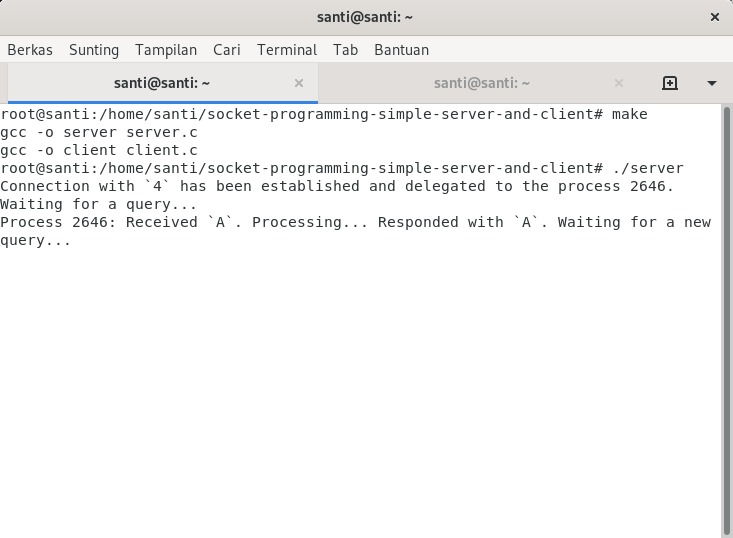
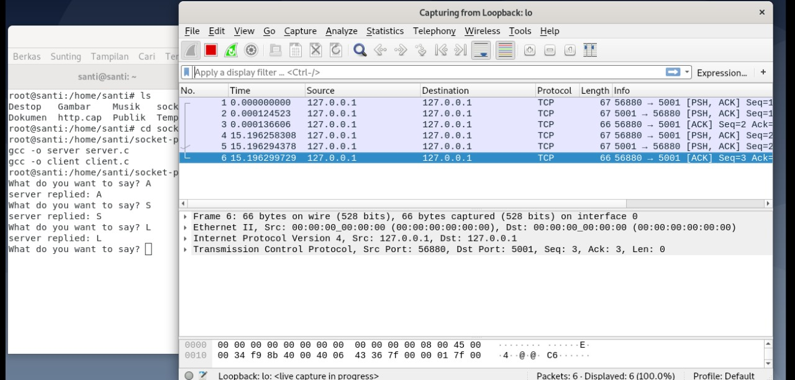
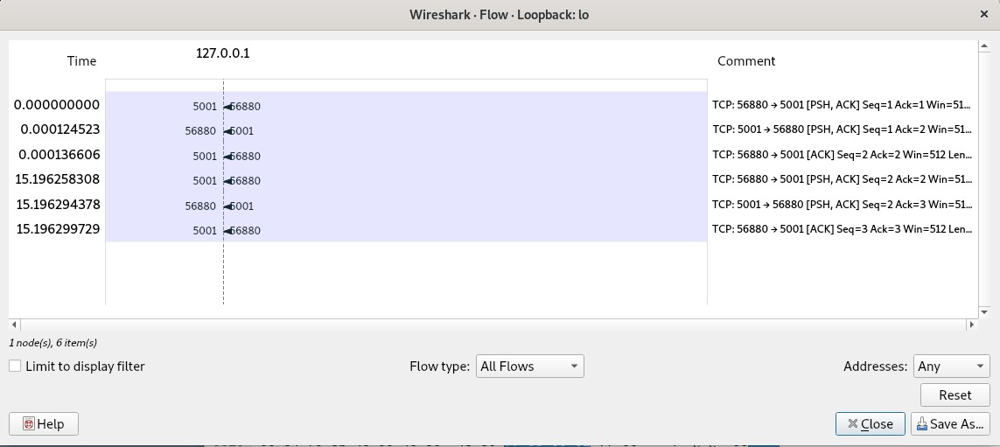

# **Tugas 1: Socket Programming - Simple Server and Client**

Pada tugas ini, kita akan melakukan serangkaian langkah untuk memahami konsep dasar pemrograman socket dengan menggunakan server dan client. Tugas ini terdiri dari beberapa tahapan yang melibatkan pengujian komunikasi antara sisi client dan server, pengamatan hasil pengiriman data, serta analisis paket data menggunakan Wireshark.

## **Langkah-langkah Tugas**

### 1. Clone Dari Github
Langkah pertama adalah mengkloning repositori socket programming dari GitHub menggunakan link berikut: [https://github.com/ferryastika/socket-programming-simple-server-and-client](https://github.com/ferryastika/socket-programming-simple-server-and-client). Dengan mengkloning repositori ini, kita akan mendapatkan kode sumber untuk server dan client yang akan digunakan dalam pengujian selanjutnya.

### 2. Test Dari Client
Setelah repositori berhasil di-clone, langkah selanjutnya adalah melakukan kompilasi dengan perintah `make` untuk mengaktifkan sisi client dan server. Setelah itu, client akan mengirimkan karakter "A" ke server untuk menguji koneksi dan komunikasi antar kedua sisi.

### 3. Test Dari Client - Respon Server
Setelah karakter "A" dikirimkan dari sisi client, server akan menerima dan menampilkan karakter tersebut. Ini merupakan konfirmasi bahwa komunikasi antara client dan server berjalan dengan baik.

### 4. Hasil Pengiriman Paket Pada Wireshark
Setelah pengiriman data, kita dapat melihat paket-paket yang ditransmisikan di Wireshark. Beberapa baris paket akan terlihat, mencerminkan komunikasi yang terjadi antara client dan server setiap kali karakter dikirimkan.

### 5. Flow Graph Pada Pengiriman Paket
Terakhir, analisis lebih lanjut dilakukan dengan melihat flow graph dari paket yang dikirimkan. Dalam grafik ini, kita dapat melihat adanya transfer data yang ditandai dengan flag [ACK] dan [PSH], yang menunjukkan bahwa data telah berhasil diterima dan diproses.

---
Dengan mengikuti langkah-langkah di atas, Anda akan mendapatkan pemahaman dasar tentang cara kerja komunikasi menggunakan socket dalam jaringan, serta bagaimana cara mengamati dan menganalisis data yang dikirimkan menggunakan Wireshark.
