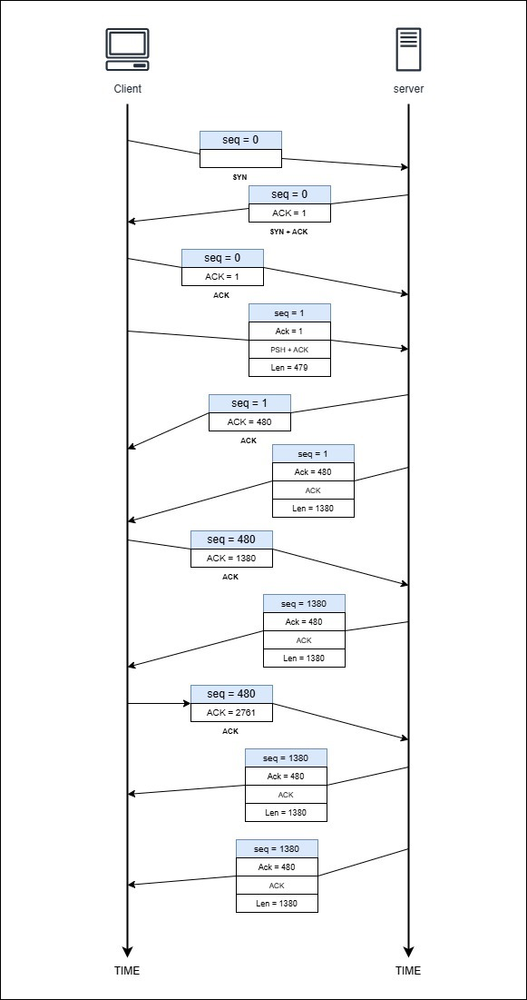

# Tugas 2: Analisis HTTP dan Three-Way Handshake dengan Wireshark

## **1. File `http.cap` di Wireshark**
File `http.cap` berisi data tangkapan paket HTTP yang dianalisis menggunakan Wireshark. Analisis ini dilakukan untuk memahami bagaimana data dikirimkan melalui protokol HTTP, termasuk identifikasi paket-paket kunci dalam komunikasi.

### **Gambar Pengiriman Paket HTTP di Wireshark**
Berikut adalah representasi tangkapan layar dari file `http.cap` di Wireshark. Gambar ini menunjukkan detail paket HTTP yang dikirimkan dan diterima:

Pada gambar di atas, paket HTTP terlihat jelas dengan detail sebagai berikut:
- **Source dan Destination IP**: Menunjukkan asal dan tujuan pengiriman paket.
- **Protocol**: HTTP (Hypertext Transfer Protocol).
- **Info**: Berisi detail permintaan (GET/POST) dan respon HTTP.

## **2. Three-Way Handshake**
Three-Way Handshake adalah proses awal yang digunakan untuk membangun koneksi antara klien dan server dalam protokol TCP. Proses ini memastikan bahwa kedua belah pihak siap untuk bertukar data dengan koneksi yang andal.

### **Identifikasi Three-Way Handshake**
Three-Way Handshake dapat ditemukan pada tiga baris pertama dalam tangkapan paket. Proses ini melibatkan tiga langkah utama:
1. **[SYN]**: Klien meminta koneksi dengan mengirimkan paket `SYN`.
2. **[SYN, ACK]**: Server merespons dengan mengirimkan paket `SYN` dan mengakui permintaan klien (`ACK`).
3. **[ACK]**: Klien mengakui respons server dengan mengirimkan paket `ACK`.

#### **Alasan Three-Way Handshake Teridentifikasi:**
- **[SYN], [SYN, ACK], [ACK] secara berurutan**: Paket ini adalah indikator utama proses Three-Way Handshake.
- **Nomor flag `ACK` pada paket kedua = nomor sequence paket pertama + 1**: Menunjukkan pengakuan dari server terhadap permintaan klien.
- **Nomor flag `ACK` pada paket ketiga = nomor sequence paket kedua + 1**: Menunjukkan pengakuan dari klien terhadap respons server.

### **Representasi Visual Three-Way Handshake**
Berikut adalah tangkapan layar yang menunjukkan alur Three-Way Handshake dalam file `http.cap`. Setiap gambar merepresentasikan langkah-langkah dalam proses ini:

1. Paket pertama (SYN) yang dikirimkan oleh klien ke server untuk memulai koneksi.
   - Flag: `SYN`.
   - Informasi: Klien meminta untuk membuka koneksi TCP.

2. Paket kedua (SYN, ACK) yang dikirimkan oleh server sebagai respons terhadap permintaan klien.
   - Flag: `SYN, ACK`.
   - Informasi: Server mengonfirmasi penerimaan permintaan dan menyetujui koneksi.

3. Paket ketiga (ACK) yang dikirimkan oleh klien sebagai pengakuan terakhir, menyelesaikan proses handshake.
   - Flag: `ACK`.
   - Informasi: Koneksi TCP berhasil dibangun.

### **Detail Proses**
- **Langkah 1: SYN**
  - Klien mengirimkan permintaan untuk memulai koneksi ke server dengan mengatur flag `SYN`.
  - Informasi utama: 
    - `Sequence Number`: Digunakan untuk mengidentifikasi permintaan.

- **Langkah 2: SYN, ACK**
  - Server menerima permintaan, mengatur flag `SYN` dan `ACK` untuk mengonfirmasi penerimaan.
  - Informasi utama:
    - `ACK Number`: `Sequence Number` dari klien + 1.

- **Langkah 3: ACK**
  - Klien mengirimkan paket dengan flag `ACK` sebagai pengakuan akhir.
  - Informasi utama:
    - `ACK Number`: `Sequence Number` dari server + 1.

### **TCP Client-Server (Step 1-11)**
Untuk memberikan gambaran yang lebih jelas mengenai alur komunikasi antara klien dan server melalui protokol TCP, berikut adalah visualisasi tahapan lengkap (Step 1-11):

Gambar di atas menunjukkan tahapan komunikasi mulai dari permintaan koneksi hingga transfer data dan terminasi koneksi.

## **Kesimpulan**
Dalam analisis file `http.cap`:
1. **Paket HTTP** berhasil diidentifikasi, termasuk proses pengiriman dan penerimaan data.
2. **Three-Way Handshake** terverifikasi berdasarkan kehadiran paket [SYN], [SYN, ACK], dan [ACK], serta validasi nomor sequence dan acknowledgment.

Dengan menggunakan Wireshark, kita dapat mempelajari lebih dalam tentang cara kerja protokol jaringan seperti HTTP dan TCP, serta memahami proses yang terjadi di balik pengiriman data.
