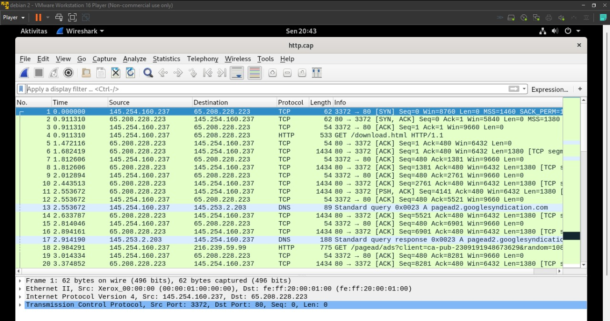
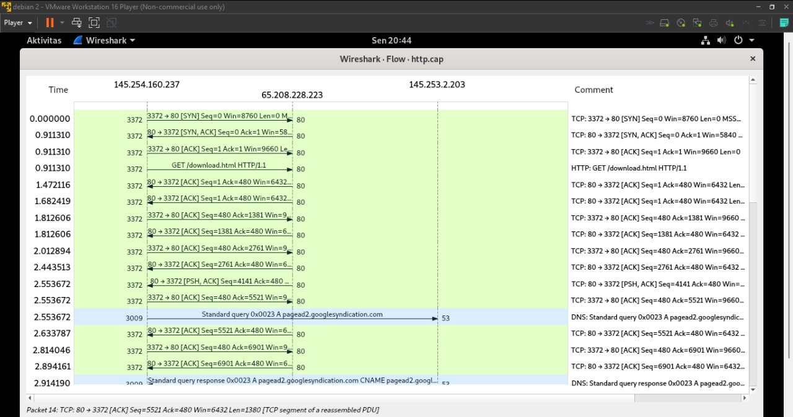
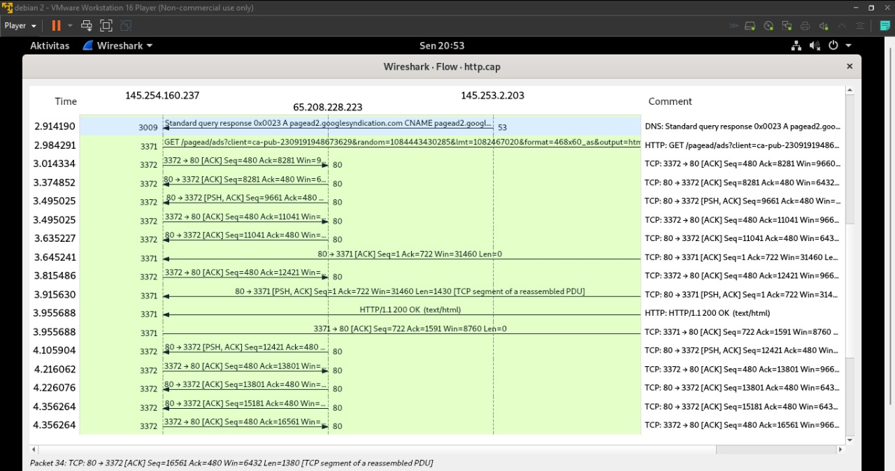
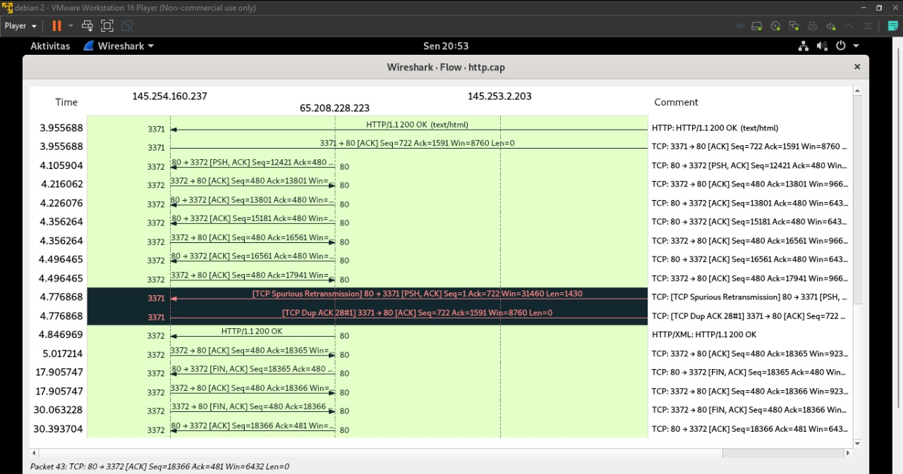

# 1224800007_Santi_TugasJaringan

### *** TUGAS 2 ***
#### 1. file http.cap di wireshark
##### Gambar pengiriman paket http.cap di wireshark

#### 2. Three Way Handsake
##### Terdapat Three Way Handsake di 3 baris pertama dengan alasan:
###### a. Ada [SYN], [SYN, ACK], [ACK] secara berurutan
###### b. Nomor flag ACK pada paket2 = seq paket1 + 1
###### c. Nomor flag ACK pada paket3 = seq paket2 + 1

