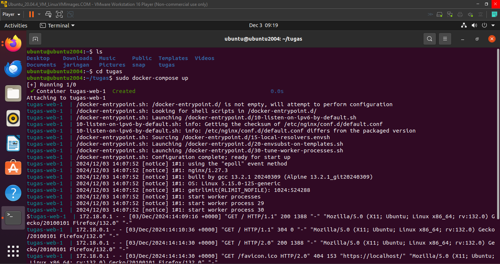
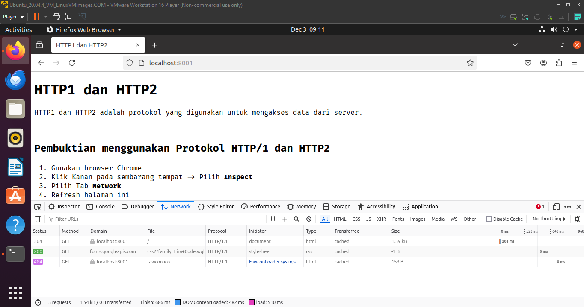
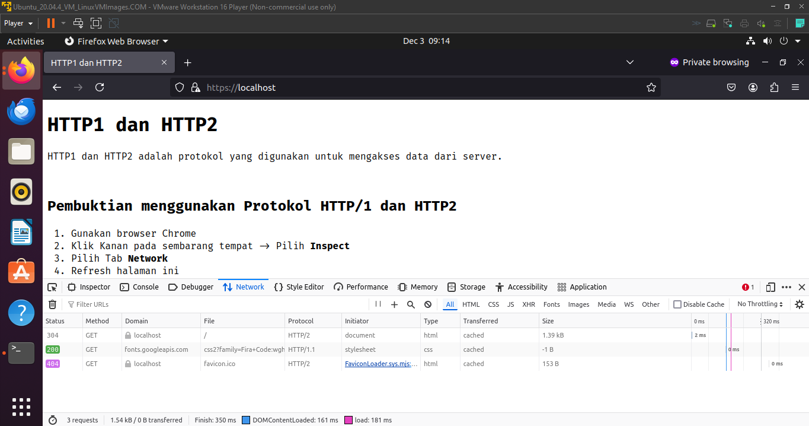

# HTTP (Hypertext Transfer Protocol)

HTTP (Hypertext Transfer Protocol) adalah protokol yang digunakan untuk komunikasi antara klien (seperti browser web) dan server di internet. HTTP memungkinkan klien dan server untuk saling bertukar data seperti halaman web, gambar, video, dan file lainnya. HTTP berfungsi sebagai dasar komunikasi untuk sebagian besar aplikasi berbasis web.

---

## Perbedaan HTTP/1, HTTP/2, dan HTTP/3

### 1. HTTP/1.1 (Versi Pertama)

HTTP/1.1 adalah versi yang paling banyak digunakan hingga saat ini. Beberapa karakteristik utama dari HTTP/1.1:

- **Satu Permintaan per Koneksi**: Setiap kali klien mengirimkan permintaan (request), koneksi TCP baru dibuat, dan hanya satu permintaan yang dapat dikirim pada satu koneksi pada satu waktu.
- **Head of Line Blocking**: Permintaan yang lambat atau terhambat dapat memblokir permintaan lainnya yang ada di antrean.
- **Penggunaan Header yang Tidak Efisien**: Header yang dikirim berulang kali dalam setiap permintaan tanpa adanya kompresi atau pengoptimalan.

### 2. HTTP/2 (Peningkatan dari HTTP/1)

HTTP/2 hadir untuk mengatasi beberapa kekurangan dari HTTP/1. Beberapa perbedaan utama HTTP/2:

- **Multiplexing**: HTTP/2 memungkinkan beberapa permintaan dan respons untuk diproses secara bersamaan di atas satu koneksi TCP. Ini mengurangi waktu tunda dan menghindari blokir antrian.
- **Header Compression**: HTTP/2 mengompresi header untuk mengurangi overhead dan meningkatkan efisiensi transmisi data.
- **Prioritas Permintaan**: HTTP/2 memungkinkan klien untuk memberikan prioritas pada permintaan tertentu, membantu server untuk mengirim data yang lebih penting terlebih dahulu.
- **Server Push**: HTTP/2 memungkinkan server untuk mengirimkan data kepada klien sebelum diminta, yang dapat meningkatkan waktu muat halaman.

### 3. HTTP/3 (Peningkatan Terbaru)

HTTP/3 adalah evolusi lebih lanjut dari HTTP/2 yang mengatasi masalah kinerja dan latensi lebih lanjut, terutama dalam hal pengelolaan koneksi dan transmisi data. Fitur utama HTTP/3 adalah:

- **QUIC (Quick UDP Internet Connections)**: HTTP/3 menggunakan QUIC, yang berbasis UDP (User Datagram Protocol), bukan TCP. QUIC menawarkan pengurangan latensi yang signifikan, terutama dalam hal koneksi yang terputus atau lambat.
- **Zero Round Trip Time (0-RTT)**: QUIC memungkinkan pengiriman data pada koneksi pertama dengan latensi minimal, yang mempercepat waktu muat halaman.
- **Multiplexing Lebih Baik**: Seperti HTTP/2, HTTP/3 mendukung multiplexing, tetapi karena menggunakan UDP, pengelolaan aliran data lebih efisien tanpa masalah head-of-line blocking.
- **Keamanan yang Ditingkatkan**: QUIC menyediakan enkripsi end-to-end secara default, meningkatkan keamanan komunikasi dibandingkan dengan HTTP/2 yang masih bergantung pada TLS (Transport Layer Security).

---

## Ringkasan Perbandingan

| Fitur                | HTTP/1.1            | HTTP/2            | HTTP/3            |
|----------------------|---------------------|-------------------|-------------------|
| Protokol Dasar       | TCP                 | TCP               | UDP               |
| Multiplexing         | Tidak               | Ya                | Ya                |
| Kompresi Header      | Tidak               | Ya                | Ya                |
| Server Push          | Tidak               | Ya                | Ya                |
| Latensi              | Lebih tinggi        | Lebih rendah      | Sangat rendah     |
| Keamanan             | TLS (Opsional)      | TLS (Opsional)    | Enkripsi Default  |
| Masalah Head of Line | Ya                  | Tidak             | Tidak             |

---

## Persiapan

### Catatan: Direkomendasikan menggunakan UNIX OS

#### 🚀 Docker
Pastikan pada mesin lokal sudah terinstall Docker dan Docker Compose.  
Jika belum, silakan download dan install dari situs resmi Docker.

#### 🔐 OpenSSL
Pastikan OpenSSL sudah terinstall.  
Jika belum, silakan install sesuai dengan OS pada mesin lokal.

#### 📂 Foldering
Buat folder proyek dan masuk ke dalam direktori folder proyek yang sudah dibuat.  
Buat folder `nginx-config` dan `ssl`.

---

## Project

#### 1. Konfigurasi Nginx
Masuk ke folder `{root_project}/nginx-config`  
Buat file `default.conf`  
Masukkan kode berikut:

    ```nginx
    server {
    # HTTP/1.1 listen on port 80
    listen 80;

    # HTTP/2 listen on port 443 for SSL
    listen 443 ssl;
    http2 on;

    # OpenSSL
    ssl_certificate /etc/nginx/certs/server.crt;
    ssl_certificate_key /etc/nginx/certs/server.key;
    ssl_protocols TLSv1.3;
    ssl_prefer_server_ciphers off;

    # Security headers
    add_header X-Content-Type-Options nosniff;

    # Root directory of website on linux os
    root /var/www/;
    index index.html;
    }
    ```

#### 2. Open SSL
Untuk menghasilkan sertifikat SSL untuk proyek Anda, ikuti langkah-langkah berikut:

1. Masuk ke direktori root proyek:
    ```bash
    cd {root_project}/
    ```

2. Buka terminal dan jalankan perintah berikut untuk menghasilkan sertifikat SSL:
    ```bash
    openssl req -x509 -newkey rsa:2048 -keyout ssl/server.key -out ssl/server.crt -days 365 -nodes
    ```

3. Isi jawaban dari pertanyaan yang diminta untuk menghasilkan sertifikat.

#### 3. Landing Page
Buat file `index.html` di direktori proyek Anda. Masukkan kode berikut ke dalam file tersebut:

    ```html
    <!DOCTYPE html>
    <html lang="en">

    <head>
        <meta charset="UTF-8">
        <meta name="viewport" content="width=device-width, initial-scale=1.0">
        <title>HTTP1 dan HTTP2</title>
        <link rel="preconnect" href="https://fonts.googleapis.com">
        <link rel="preconnect" href="https://fonts.gstatic.com" crossorigin>
        <link href="https://fonts.googleapis.com/css2?family=Fira+Code:wght@300..700&family=Roboto+Slab:wght@100..900&display=swap" rel="stylesheet">
        <style>
            body {
                font-family: 'Fira Code', 'Arial Narrow', Arial, sans-serif, sans-serif;
            }
        </style>
    </head>

    <body>
        <h1>HTTP1 dan HTTP2</h1>
        <p>HTTP1 dan HTTP2 adalah protokol yang digunakan untuk mengakses data dari server.</p>
        <br>
        <h2>Pembuktian menggunakan Protokol HTTP/1 dan HTTP2</h2>
        <ol>
            <li>Gunakan browser Chrome</li>
            <li>Klik Kanan pada sembarang tempat -> Pilih <strong>Inspect</strong></li>
            <li>Pilih Tab <strong>Network</strong></li>
            <li>Refresh halaman ini</li>
            <li>Lihat baris request halaman ini (localhost)</li>
            <li>Lihat bagian kolom <strong>Protocol</strong></li>
            <li>Jika tidak ada kolom <strong>Protocol</strong>, klik kanan pada salah satu kolom -> <strong>Check Protocol</strong></li>
            <li>HTTP1 -> Protokol:HTTP1</li>
            <li>HTTP2 -> Protokol:h2</li>
        </ol>
    </body>

    </html>
    ```

Simpan file menjadi `index.html`.

### Docker Compose

#### 1. Docker Compose

Buat file `docker-compose.yml` di direktori proyek Anda dan masukkan kode berikut:

    ```yaml
    version: '3.8'
    services:
    web:
        image: nginx:alpine
        ports:
        - "8001:80" # HTTP/1.1
        - "443:443" # HTTP/2
        volumes:
        - ./nginx-config:/etc/nginx/conf.d
        - ./ssl:/etc/nginx/certs
        - ./index.html:/var/www/index.html

## Uji Coba HTTP1

1. Masuk ke Direktori Proyek

   Masuk ke direktori `{root_project}/` di terminal.

2. Jalankan Docker Compose

3. Jalankan perintah berikut untuk menghidupkan Docker Compose:

    ```bash
    docker-compose up



4. Buka browser Chrome, akses localhost pada port 8001 localhost:8001
5.Ikuti petunjuk dari web tersebut
6.Protokol HTTP/1



## Uji Coba HTTP2
1. Akses https://localhost untuk HTTP/2
2. Protokol HTTP/2

