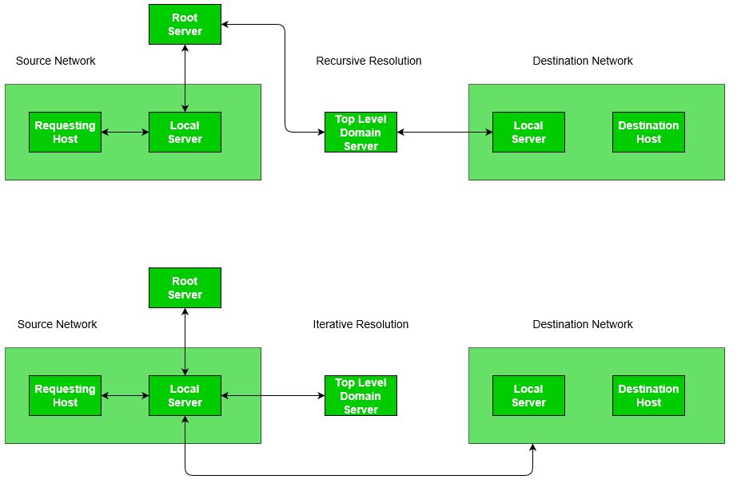
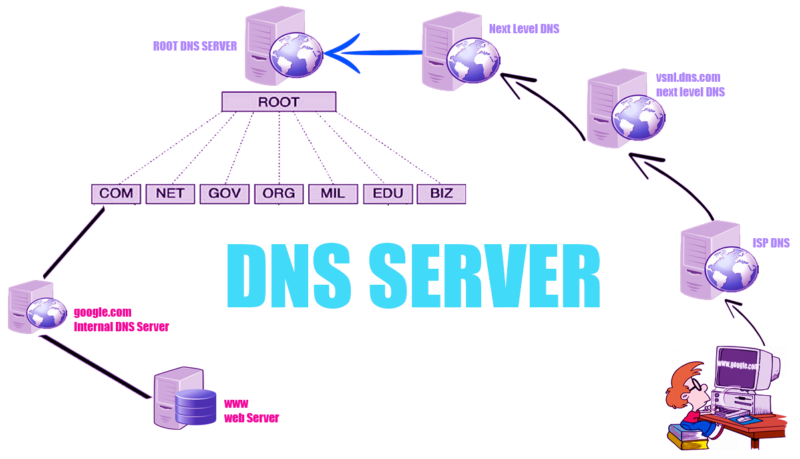

# **Mapping Alamat IP ke Nama Domain**

**Tugas ini membahas cara memetakan alamat IP ke nama domain menggunakan DNS**, termasuk jenis-jenis resolusi yang digunakan dalam proses ini.

---

## **Pengertian dan Cara Kerja DNS**
**Domain Name System (DNS)** adalah layanan jaringan yang tugasnya menerjemahkan nama domain (seperti **www.google.com**) menjadi **IP address**.

DNS pada dasarnya mirip seperti aplikasi kontak di dalam ponsel. Aplikasi ini biasanya berisi daftar nama kontak dan nomor telepon. Ketika ingin menelepon seseorang, kita tidak perlu menghafal nomor teleponnya, cukup mencari nama kontaknya saja. Tentu saja, ini membuat hidup lebih mudah karena tidak perlu mengingat setiap nomor telepon.

DNS bekerja dengan cara yang sama. **DNS adalah mekanisme yang memungkinkan kita untuk menelusuri situs web di internet.** Sama seperti ponsel yang tidak bisa menelepon tanpa mengetahui nomor telepon orang yang dituju, browser juga tidak tahu cara membuka situs web hanya dengan nama domain. Browser perlu mengetahui **IP address** dari situs web tersebut agar dapat diakses.

Misalnya:
- Sangat jauh lebih mudah mengetikkan nama domain **www.google.com** di browser daripada harus mengingat bahwa salah satu IP address situs tersebut adalah **216.58.194.174**.

---
## **Jenis Resolusi**
Resolusi DNS dapat berupa **rekursif** atau **iteratif**.

### **1. Resolusi Rekursif**
Dalam resolusi rekursif, klien meminta server lokal untuk memberikan jawaban akhir atau pesan kesalahan. **Prosesnya:**
1. Aplikasi menghasilkan **kueri DNS** ke resolver untuk mendapatkan alamat IP tujuan.
2. Resolver meneruskan kueri ke **server DNS lokal**.
3. Jika server DNS lokal tidak mengetahui alamat IP, kueri diteruskan ke **root name server**.
4. Root name server mengarahkan kueri ke **server domain tingkat atas (Top-Level Domain Server)**.
5. Jika server tersebut tidak memiliki peta:
   - Server memberikan alamat IP dari **server DNS lokal tujuan**.
6. Informasi akhirnya dikirim kembali melalui jalur yang sama hingga mencapai klien.

---

### **2. Resolusi Iteratif**
Dalam resolusi iteratif, setiap server yang tidak mengetahui pemetaan memberikan alamat IP dari server berikutnya kepada klien untuk diteruskan. **Prosesnya:**
1. Kueri DNS dikirimkan ke **server DNS lokal**.
2. Jika server lokal tidak mengetahui alamat IP, server mengarahkan kueri ke **root name server**.
3. Root name server memberikan alamat IP **server domain tingkat atas**.
4. Server domain tingkat atas memberikan:
   - Alamat IP host tujuan, atau
   - Alamat IP server DNS lokalnya.
5. Resolver meneruskan kueri secara berulang ke server yang diberikan hingga mendapatkan jawaban akhir.

---

### **Perbedaan Utama**
| **Resolusi Rekursif**         | **Resolusi Iteratif**         |
|-------------------------------|-------------------------------|
| Server DNS bertanggung jawab untuk mendapatkan jawaban akhir. | Klien bertanggung jawab untuk meneruskan kueri ke server berikutnya. |
| Klien menerima jawaban atau pesan kesalahan langsung.         | Klien menerima alamat IP server berikutnya hingga jawaban ditemukan. |

---

## **Diagram Proses Resolusi**


---

## **Anatomi Nama Domain**
Ketahuilah bahwa setiap nama domain atau **domain name** memiliki tiga bagian utama, yang mana masing-masing melayani tujuan tertentu. Mari kita ambil contoh salah satu nama domain ternama, yakni **www.google.com**.  

Apabila Anda perhatikan, nama domain **www.google.com** punya tiga bagian yang seharusnya mudah dikenali lantaran masing-masing dipisahkan oleh titik, yakni **www** (subdomain), **google** (domain), dan **com** (top-level domain).

### **1. Subdomain**
Bagian **www** dari contoh **www.google.com** dikenal sebagai **subdomain**. Secara teknis, Anda dapat memiliki banyak subdomain, contohnya **host.sub.sub.subdomain.domain.com**.

### **2. Domain**
Bagian selanjutnya ialah **domain**. Ia merupakan nama yang kerap digunakan untuk merujuk ke bagian kedua dari struktur nama domain. Dalam contoh **www.google.com**, yang disebut domain adalah **google**.

### **3. Top-Level Domain (TLD)**
**Top-Level Domain** atau biasa disingkat **TLD** adalah bagian terakhir dari sebuah nama domain. Dalam contoh **www.google.com**, bagian **.com** merupakan TLD.

Saat Anda menggabungkan ketiga bagian di atas (**Subdomain + Domain + TLD**), maka itu disebut **Fully Qualified Domain Name (FQDN)**. Jadi, contoh **www.google.com** yang sedari tadi kita bincangkan merupakan **FQDN**.

Setiap orang, perusahaan, atau bisnis mana pun bisa mendaftarkan dan memilih domain yang diinginkan (sesuai ketersediaan). Pendaftaran domain biasanya berada di bawah kendali **Registrar** atau **Domain Name Registrar**, yakni sebuah organisasi atau badan komersial yang bertugas menjadi tempat pendaftaran nama domain yang sudah diakreditasi oleh **ICANN**.

---

## **Cara Kerja DNS**
Berikut adalah proses **DNS resolution** saat kita membuka **google.com** di browser.

1. **Pengecekan Cache**:  
   Saat Anda membuka **google.com** di browser, hal pertama yang akan dilakukan browser adalah mengecek **browser cache** untuk melihat apakah di sana tersimpan IP address dari website **google.com**. Apabila tidak ditemukan di browser cache, maka browser akan mengecek **DNS cache** dan **Hosts file**. Bila tidak ditemukan, maka langkah selanjutnya adalah menghubungi **Recursive DNS Server**.

2. **Pengecekan pada Recursive DNS Server**:  
   Jika **Recursive DNS Server** memiliki informasi **IP address** untuk **google.com** di dalam cache miliknya, ia akan langsung memberikan informasi tersebut ke client dan takkan lanjut ke langkah berikutnya. Bila tidak ada di sana, **Recursive DNS Server** akan meneruskan permintaan ke **Root DNS Server**.

3. **Root DNS Server**:  
   Kemudian, **Root DNS Server** memberikan informasi tentang **TLD Server** yang sesuai (yakni **.com TLD Server**) ke **Recursive DNS Server**. Setelah mendapatkan informasi tentang TLD Server, **Recursive DNS Server** akan menghubungi **TLD Server** tersebut.

4. **TLD Server**:  
   **TLD Server** kemudian memberikan informasi yang berkenaan dengan **Authoritative Name Server** yang sesuai (**google.com**) ke **Recursive DNS Server**. Setelah mendapatkan informasi tersebut, **Recursive DNS Server** pun langsung menghubungi **Authoritative Name Server**.

5. **Authoritative Name Server**:  
   **Authoritative Name Server** berisi informasi nama domain tertentu yang ia layani. Di sinilah kita bisa menemukan **IP address** dari nama domain **google.com**. **Authoritative Name Server** pun kemudian memberikan **IP address** dari nama domain yang diminta (**google.com**) ke **Recursive DNS Server**.

6. **Pengembalian IP Address ke Client**:  
   Lalu, **IP address** yang diterima oleh **Recursive DNS Server** akan disimpan ke dalam cache untuk kurun waktu tertentu. Sehingga bila nanti datang permintaan yang sama dari client, ia tak perlu melakukan **DNS resolution** secara penuh lagi. Setelah itu, **Recursive DNS Server** mengasihkan **IP address** tadi ke client (browser).

7. **Permintaan HTTP**:  
   Usai menerima **IP address**, browser kemudian mengirimkan permintaan (request) untuk **google.com** ke server **google** melalui IP address tersebut. Server **google.com** pun memproses dan mengembalikan respons berupa halaman web untuk **google.com** ke browser. Browser lantas memuat/menampilkan halaman **google.com** ke hadapan pengguna.

---

### **Alur Kerja DNS**
 
> *Gambar ini menggambarkan alur kerja DNS saat melakukan pencarian alamat IP dari nama domain.*

---

## **Tools untuk Menganalisis DNS**
Berikut adalah beberapa **tools** yang dapat digunakan untuk menganalisis dan memverifikasi DNS dari suatu domain:

1. **nslookup (Network Status Lookup)**  
   **nslookup** adalah utilitas yang digunakan untuk memeriksa DNS. Anda dapat menggunakan alat ini untuk menemukan informasi tentang server DNS dan memverifikasi alamat IP dari nama domain.  
   **Contoh penggunaan**:
   ```bash
   nslookup google.com
   # Informasi DNS: Alamat IP yang Terhubung dengan google.com

Dokumen ini memberikan informasi tentang alat dan layanan yang dapat digunakan untuk mengetahui alamat IP yang terhubung dengan `google.com`.

2. **Dig (Domain Information Groper)**  
   `dig` adalah alat yang lebih kuat dan fleksibel dibandingkan dengan `nslookup`. Alat ini memberikan informasi lebih rinci mengenai DNS record, seperti A, AAAA, MX, dan sebagainya.  
   **Contoh penggunaan**:
   ```bash
   nslookup google.com
   # Informasi DNS: Alamat IP yang Terhubung dengan google.com

Contoh Penggunaan:

```bash
dig google.com