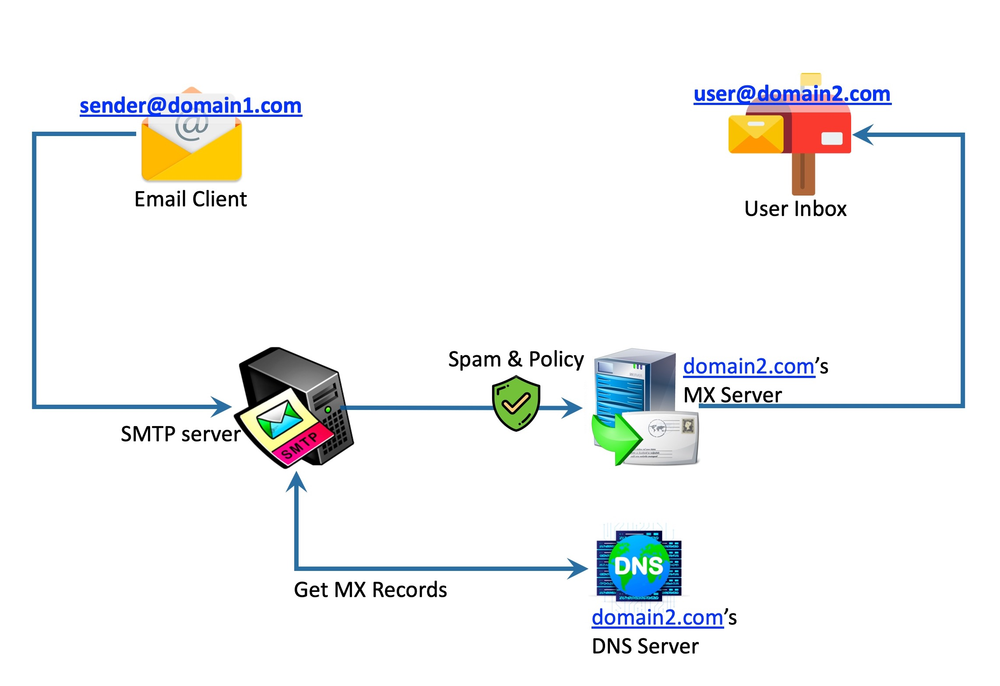

# Penjelasan tentang SMTP (Simple Mail Transfer Protocol)

SMTP (Simple Mail Transfer Protocol) adalah protokol jaringan yang digunakan untuk mengirim email dari pengirim ke penerima melalui jaringan internet. SMTP sangat penting dalam komunikasi email, karena bertanggung jawab untuk pengiriman pesan antar server email. Artikel ini akan memberikan penjelasan lengkap mengenai arsitektur, alur kerja, dan berbagai alat yang digunakan untuk menguji SMTP.

## Arsitektur dan Komponen SMTP

### 1. **Client SMTP**
Client SMTP adalah perangkat atau aplikasi yang digunakan oleh pengirim untuk mengirimkan email. Contoh perangkat ini adalah aplikasi email seperti Microsoft Outlook, Mozilla Thunderbird, atau aplikasi web seperti Gmail. Client SMTP akan menghubungi server SMTP untuk mengirimkan email.

### 2. **Mail Transfer Agent (MTA)**
MTA adalah server yang bertanggung jawab untuk mengirim dan menerima email. Setelah email dikirimkan dari client SMTP, MTA akan mengarahkan pesan tersebut ke server tujuan melalui jaringan. MTA menggunakan protokol SMTP untuk berkomunikasi dengan server lain.

### 3. **Mail Delivery Agent (MDA)**
Setelah MTA mengirimkan email ke server tujuan, MDA bertanggung jawab untuk menyimpan pesan dalam kotak surat penerima. MDA menggunakan protokol lain seperti POP3 atau IMAP untuk mengakses email oleh penerima.

### 4. **Mail Server**
Mail server adalah server yang menyimpan email. Dalam hal ini, ada dua jenis server yang terlibat:
   - **SMTP Server**: Server yang digunakan untuk mengirim email.
   - **POP3/IMAP Server**: Server yang digunakan oleh penerima untuk mengambil atau mengunduh email dari server.

### 5. **DNS (Domain Name System)**
DNS digunakan untuk mencari alamat IP dari server tujuan berdasarkan domain yang dimasukkan dalam alamat email penerima (misalnya `example.com`). DNS membantu dalam menentukan server SMTP yang akan digunakan untuk mengirimkan email.

### 6. **MX (Mail Exchange) Record**
MX Record adalah jenis DNS record yang digunakan untuk menunjukkan server yang bertanggung jawab menerima email untuk domain tertentu. Ketika email dikirimkan, server SMTP akan mencari MX record untuk mengetahui server tujuan yang tepat.

## Alur Kerja SMTP (Tahapan Pengiriman Email)

Proses pengiriman email melalui SMTP terdiri dari beberapa tahap. Berikut adalah alur kerjanya:

---

### **Alur Kerja DNS**
 
> *Gambar ini menggambarkan alur kerja DNS saat melakukan pencarian alamat IP dari nama domain.*

---

##### Tahap 1: Penulisan dan Pengiriman Email
1. Pengguna menulis email menggunakan **klien email** (MUA) dan menekan tombol "Kirim".
2. MUA menghubungi server SMTP untuk mengirimkan email.

##### Tahap 2: Koneksi ke Server SMTP
1. MUA membangun koneksi dengan server SMTP menggunakan protokol **TCP/IP** pada port yang sesuai (25, 465, atau 587).
2. Server SMTP menerima permintaan koneksi dan memulai sesi SMTP.

##### Tahap 3: Proses Pengiriman Email
Komunikasi antara klien dan server SMTP terjadi melalui perintah dan respon berikut:

- **HELO/EHLO**: Klien memperkenalkan dirinya ke server.
  - Contoh:
    ```bash
    HELO example.com
    ```
- **MAIL FROM**: Klien menginformasikan alamat pengirim.
  - Contoh:
    ```bash
    MAIL FROM:<pengirim@example.com>
    ```
- **RCPT TO**: Klien menginformasikan alamat penerima.
  - Contoh:
    ```bash
    RCPT TO:<penerima@example.com>
    ```
- **DATA**: Klien mengirimkan isi email, termasuk header (subject, tanggal, dll.) dan body email. Setelah selesai, diakhiri dengan tanda titik (.) pada baris kosong.
  - Contoh:
    ```bash
    DATA  
    Subject: Tes Email  
    Ini adalah email uji coba.  
    .
    ```
- **QUIT**: Mengakhiri koneksi dengan server.

##### Tahap 4: Transfer Antar Server SMTP
1. Jika penerima menggunakan domain yang berbeda, server SMTP mengirimkan email ke **MTA** lain hingga mencapai server penerima.

##### Tahap 5: Penyimpanan dan Pengambilan Email
1. Setelah mencapai server penerima, email disimpan oleh **MDA** (Mail Delivery Agent).
2. Penerima mengambil email melalui protokol **POP3** atau **IMAP**.

## Tools untuk Menguji SMTP

Beberapa alat dapat digunakan untuk menguji konfigurasi dan konektivitas SMTP. Berikut adalah beberapa tools yang populer:

### 1. **Telnet**
Telnet dapat digunakan untuk menguji konektivitas ke server SMTP dan memverifikasi apakah server SMTP menerima koneksi di port yang benar.

**Contoh Penggunaan**:

    ```bash
    telnet smtp.example.com 25
# Alat dan Keamanan SMTP

SMTP (Simple Mail Transfer Protocol) adalah protokol penting yang digunakan untuk mengirim email di seluruh dunia. Artikel ini akan menjelaskan beberapa alat yang dapat digunakan untuk menguji server SMTP, serta mekanisme keamanan yang penting untuk melindungi pengiriman email.

#### 1. MXToolbox

[MXToolbox](https://mxtoolbox.com/) adalah alat online yang memungkinkan Anda untuk memeriksa server SMTP dan DNS. Anda dapat menggunakan MXToolbox untuk:
- Memverifikasi koneksi ke server SMTP
- Memeriksa status server
- Menganalisis masalah terkait pengiriman email

Alat ini sangat berguna untuk memeriksa konfigurasi dan kesehatan server SMTP, serta memastikan bahwa server email Anda bekerja dengan baik.

#### 2. SMTP Diag Tool

[SMTP Diag Tool](https://www.smtpdiagrams.com/) adalah alat gratis yang dapat digunakan untuk mendiagnosis masalah SMTP. Dengan menggunakan alat ini, Anda dapat:
- Menguji server SMTP
- Menganalisis log server SMTP
- Memastikan pengaturan server SMTP sudah benar

Alat ini sangat berguna untuk troubleshooting dan memastikan bahwa server SMTP dapat berfungsi dengan baik dalam pengiriman email.

#### 3. SendGrid SMTP Test

[SendGrid](https://sendgrid.com/) menawarkan alat uji SMTP untuk menguji pengiriman email melalui server mereka. Alat ini dirancang khusus untuk pengguna yang menggunakan SendGrid sebagai penyedia layanan pengiriman email massal. Fitur utama alat ini adalah:
- Menguji pengiriman email melalui server SendGrid
- Menyediakan analisis performa pengiriman email
- Membantu mengidentifikasi masalah dalam pengiriman email massal

SendGrid merupakan solusi yang sangat berguna bagi pengguna yang mengirimkan email dalam jumlah besar atau melakukan kampanye email marketing.

#### 4. SMTP Test Tool by Wormly

[Wormly](https://www.wormly.com/test_smtp_server) menyediakan alat uji SMTP yang memungkinkan Anda untuk menguji server SMTP dari berbagai lokasi di dunia. Fitur utama alat ini meliputi:
- Memverifikasi konektivitas ke server SMTP
- Menguji server SMTP dari lokasi global
- Memberikan laporan tentang status server SMTP

Alat ini sangat membantu untuk memverifikasi apakah server SMTP Anda dapat diakses dari berbagai tempat dan mengidentifikasi masalah koneksi.

## Keamanan SMTP

SMTP pada dasarnya tidak menyediakan enkripsi untuk data yang dikirimkan, yang dapat membuat pengiriman email rentan terhadap penyadapan. Untuk mengatasi masalah ini, beberapa mekanisme keamanan ditambahkan pada SMTP, antara lain:

#### 1. SMTP Authentication (SMTP-AUTH)

SMTP Authentication memastikan bahwa hanya pengguna yang sah yang dapat mengirim email melalui server SMTP. Hal ini membantu mengurangi risiko penyalahgunaan server untuk mengirim email spam atau email tidak sah.

#### 2. STARTTLS

STARTTLS adalah protokol yang memungkinkan SMTP untuk mengenkripsi komunikasi dengan menggunakan SSL/TLS. Dengan menggunakan STARTTLS, data yang dikirimkan melalui SMTP dapat dienkripsi untuk melindungi informasi sensitif seperti kata sandi dan isi email.

#### 3. DKIM (DomainKeys Identified Mail)

DKIM adalah metode autentikasi email yang memungkinkan pengirim untuk menandatangani pesan email dengan kunci pribadi mereka. Penerima kemudian dapat memverifikasi integritas dan keaslian pesan tersebut, yang membantu mengurangi risiko pemalsuan email.

#### 4. SPF (Sender Policy Framework)

SPF adalah mekanisme yang digunakan untuk memverifikasi bahwa pengirim email memiliki izin untuk mengirim email dari domain tertentu. SPF membantu mencegah spoofing email dan pengiriman spam, serta meningkatkan kepercayaan penerima terhadap email yang dikirim.

## Kesimpulan

SMTP adalah protokol yang sangat penting dalam pengiriman email di seluruh dunia. Arsitektur SMTP melibatkan berbagai komponen seperti client, MTA, dan MDA yang bekerja bersama-sama untuk memastikan pengiriman email yang efisien dan aman. Menggunakan alat uji SMTP dan memahami alur kerja SMTP akan membantu Anda untuk mengonfigurasi dan mendiagnosis masalah terkait pengiriman email.

Dengan memanfaatkan mekanisme keamanan seperti SMTP-AUTH, STARTTLS, DKIM, dan SPF, Anda dapat meningkatkan keamanan pengiriman email dan melindungi data sensitif selama proses komunikasi.

